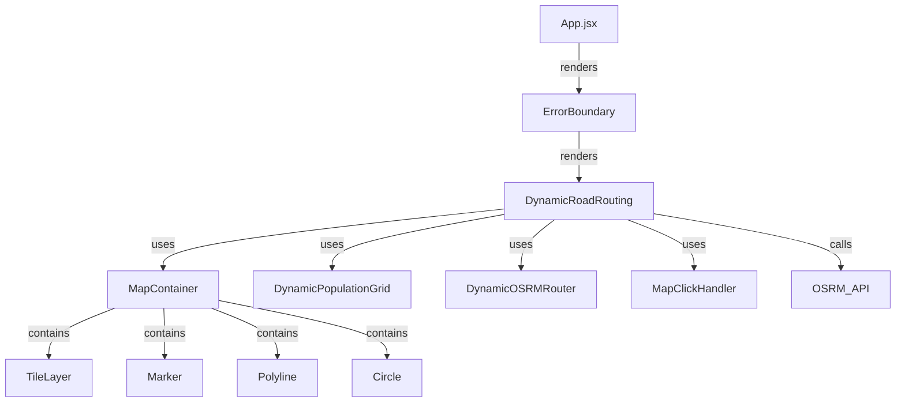

# Simhastha 2028 Smart Pilgrim Route Planner

A modern React web application for dynamic, crowd-aware route planning during the Simhastha 2028 event in Ujjain. The app helps pilgrims and event organizers find the safest and most efficient routes by dynamically avoiding crowded areas in real time.

---

## Table of Contents

- [Features](#features)
- [How It Works](#how-it-works)
- [Architecture Overview](#architecture-overview)
- [Key Components](#key-components)
- [Crowd Simulation & Routing Logic](#crowd-simulation--routing-logic)
- [Technologies Used](#technologies-used)
- [Getting Started](#getting-started)
- [Project Structure](#project-structure)
- [Extending the App](#extending-the-app)
- [Notes](#notes)

---

## Features

- **Interactive Map**: Pan, zoom, and interact with a live map of Ujjain.
- **Dynamic Routing**: Calculates optimal routes that avoid crowded areas using real-time data.
- **Crowd Simulation**: Right-click to add simulated people/crowds to any location.
- **Multiple Route Options**: View direct, avoidance, and alternative routes, with crowd intersection analysis.
- **Route Analysis**: See route statistics (distance, crowd intersection, efficiency, etc.).
- **Modern UI**: Clean, responsive panels for instructions, controls, and route info.
- **Error Handling**: Robust error boundaries prevent the app from crashing.

---

## How It Works

1. **Set Start/End Points**:  
   - Left-click on the map to set the start point.
   - Left-click again to set the end point.
   - A third click resets the start point.

2. **Simulate Crowds**:  
   - Right-click anywhere on the map to add a "person" (increase population) at that location.
   - The app groups nearby people into "crowd zones" and visualizes them as colored circles (green/orange/red/darkred based on density).

3. **Calculate Routes**:  
   - Click the "Calculate Routes" button to generate multiple route options:
     - **Direct Route**: The shortest path.
     - **Avoidance Route**: Tries to go around the most crowded areas.
     - **Alternative Route**: If available, a different path from OSRM.
   - The app analyzes each route for how much it intersects with crowd zones and selects the best one.

4. **View & Analyze**:  
   - Switch between route options in the sidebar.
   - View detailed route analysis: type, crowd intersection, number of points, distance, and efficiency score.

5. **Reset/Clear**:  
   - Use "Clear All" to remove all crowds and routes.
   - Use "Add Test Crowds" to quickly simulate a crowded scenario.

---

## Architecture Overview



- **App.jsx**: Entry point, renders the main map and routing UI.
- **DynamicRoadRouting.jsx**: Core logic for map, crowd simulation, and routing.
- **DynamicPopulationGrid**: Manages population data and crowd zones.
- **DynamicOSRMRouter**: Handles route calculation and crowd avoidance using OSRM.
- **MapClickHandler**: Handles user clicks and right-clicks on the map.

---

## Key Components

### `DynamicRoadRouting.jsx`
- Main component for all map and routing logic.
- Manages state for start/end points, crowd data, routes, and UI panels.
- Handles user interaction and calls routing logic.

### `DynamicPopulationGrid`
- Tracks population in a grid.
- Groups people into crowd zones.
- Assigns routing "weights" to crowded areas.

### `DynamicOSRMRouter`
- Calls the OSRM API for route calculation.
- Supports direct, avoidance (with waypoints), and alternative routes.
- Analyzes how much each route intersects with crowd zones.

### `MapClickHandler`
- Uses `useMapEvents` from React-Leaflet to handle map clicks and right-clicks.

---

## Crowd Simulation & Routing Logic

- **Crowd Zones**:  
  - When you add people, the app groups them into zones.
  - Each zone has a center, radius, population, and routing weight.
  - Zones are visualized as colored circles.

- **Routing**:  
  - The app requests routes from the OSRM public API.
  - For avoidance, it adds waypoints to steer the route around the most crowded zone.
  - Each route is scored based on how much it intersects with crowd zones.

- **Route Analysis**:  
  - The app calculates statistics for each route:
    - Total points (segments)
    - Number of crowded points
    - Average crowd weight
    - Total distance
    - Efficiency score (higher = less crowd intersection)

---

## Technologies Used

- **React**: UI framework.
- **React-Leaflet** & **Leaflet**: Interactive maps.
- **OpenStreetMap**: Map tiles.
- **OSRM**: Routing engine (public demo server).
- **JavaScript (ES6+)**: All logic and components.

---

## Getting Started

1. **Install dependencies:**
   ```bash
   npm install
   ```
2. **Start the development server:**
   ```bash
   npm run dev
   ```
3. **Open your browser** to the local address provided (usually `http://localhost:5173`).

---

## Project Structure
